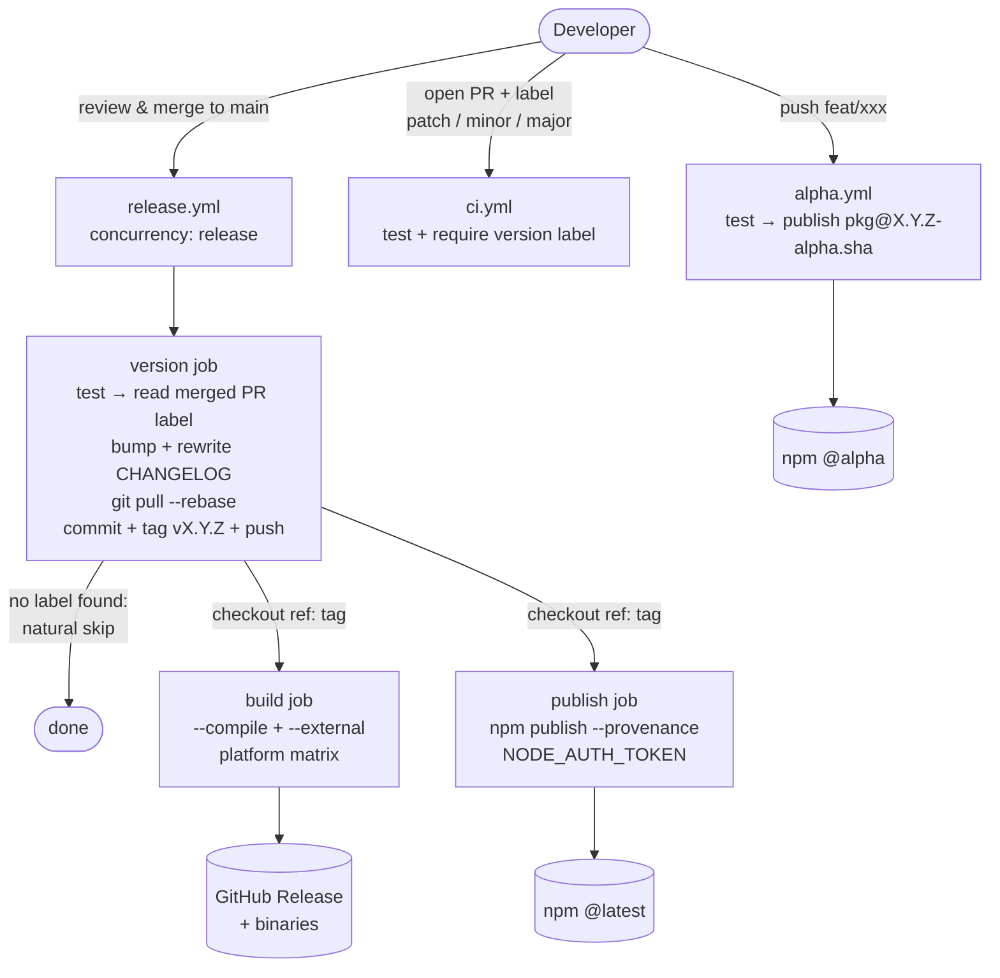

# Release Pipeline Patterns

This skill captures hard-won patterns for automating releases of open-source npm packages on GitHub Actions. Every pattern here traces back to a real failure mode — the "why" matters because every project has slightly different trade-offs, and you need to judge which pieces apply.

## When to pull this skill in

Typical signals:
- User is writing or modifying `.github/workflows/release.yml` (or equivalent)
- Release CI is failing intermittently: duplicate tags, version mismatches, "tag already exists", push rejected
- User asks how to automate version bumping, publish to npm, or add `--provenance`
- User is choosing between manual tagging, release-it, changesets, semantic-release
- User is distributing a CLI and hitting issues with `bun --compile` / `pkg` / `ncc`
- Merge queue is enabled and CI doesn't run / double-runs
- User wants to publish prerelease/alpha versions from feature branches

If the user's pipeline is already mature and they're asking an unrelated CI question (lint caching, docker image size, etc.), this skill is not the right fit.

## The two highest-leverage ideas

Before the detailed patterns, internalize these two — everything else follows from them:

1. **Version is decided exactly once, and CI is where it happens.** The moment a human types `npm version patch` locally, you have two possible sources of truth. Pick one — and for automated pipelines, it should be CI. The human's only version-related action is picking a label (or writing a CHANGELOG entry).

2. **Releases are not idempotent; treat them like a distributed system.** Two PRs merging seconds apart, a release commit triggering its own release workflow, a tag pushed before `main` was updated — these are not edge cases, they are the default unless you design against them. Concurrency control + checkout-by-tag + natural skip conditions are the baseline, not polish.

## The pipeline at a glance

Three workflow files, one human input (a PR label), three published artifacts (alpha npm package for previews, stable npm package, GitHub Release with binaries).



## The pattern library

### 1. Single version authority via PR labels

**The idea:** Require each PR merged to `main` to carry exactly one of `patch` / `minor` / `major`. Release CI reads the label of the just-merged PR and bumps accordingly. No human types a version number.

**Why:** Alternatives all leak. Manual `npm version` before merging requires rebases when it loses the race. `release-it` locally requires a pre-push hook to stop direct pushes. Conventional commits require everyone to write them correctly. Labels are visible in the PR UI, enforced by CI, and orthogonal to commit content — authors and reviewers see them before merging.

**Implementation:**

```yaml
# ci.yml — block merge without a label
jobs:
  check-label:
    runs-on: ubuntu-latest
    steps:
      - uses: actions/github-script@v7
        with:
          script: |
            const labels = context.payload.pull_request.labels.map(l => l.name);
            const versionLabels = labels.filter(l => ['patch', 'minor', 'major'].includes(l));
            if (versionLabels.length === 0) {
              core.setFailed('PR must have a version label: patch, minor, or major');
            } else if (versionLabels.length > 1) {
              core.setFailed('PR must have exactly one version label');
            }
```

```yaml
# release.yml — read label on merge, bump, tag, push
- uses: actions/github-script@v7
  id: label
  with:
    script: |
      const prs = await github.rest.repos.listPullRequestsAssociatedWithCommit({
        owner: context.repo.owner, repo: context.repo.repo, commit_sha: context.sha,
      });
      const merged = prs.data.find(pr => pr.merged_at);
      if (!merged) { core.setOutput('bump_type', ''); return; }
      const bump = merged.labels.map(l => l.name).find(l => ['patch','minor','major'].includes(l));
      core.setOutput('bump_type', bump || '');
```

### 2. Natural skip logic, not detection

**The idea:** When your release workflow itself pushes a commit to `main`, that push re-triggers the workflow. Don't detect this with string matching (`if commit.message startsWith 'Release'`). Instead, structure the pipeline so the release commit *naturally has nothing to do*.

**Why:** String-match detection is fragile (commit message style drifts, someone writes "Release notes" in a feature PR) and obscures intent. If "no PR was merged in this push" and "no version label on that PR" both lead to a clean no-op, then release commits skip automatically: they weren't merged via a PR, so there's no label, so the workflow exits. One condition, no special case.

```yaml
# Either of these outputs == '' means: do nothing further
if: steps.label.outputs.bump_type != ''
```

Any downstream job gates on the version output being non-empty. No `check` job, no commit-message regex.

### 3. Concurrency safety (the three-part pattern)

When multiple PRs merge close together, release workflows run in parallel. Without care, you get: duplicate tags, `rejected (non-fast-forward)` on push, wrong binaries in a GitHub Release, versions that skip numbers. All three of these are needed:

```yaml
# a) Serialize release runs — never run two at once
concurrency:
  group: release
  cancel-in-progress: false  # do NOT cancel — let each finish cleanly
```

```yaml
# b) Rebase before pushing — another release may have advanced main
- run: |
    git pull --rebase origin main
    npm version "$BUMP" --no-git-tag-version
    git commit -am "Release $NEW_VERSION"
    git tag "v$NEW_VERSION"
    git push && git push origin "v$NEW_VERSION"
```

```yaml
# c) Downstream jobs check out by tag, NOT by main
build:
  needs: version
  steps:
    - uses: actions/checkout@v4
      with:
        ref: v${{ needs.version.outputs.new_version }}  # frozen to this release
```

The third point is the one most people miss: if `build` checks out `main`, a later release commit can advance `main` before `build` runs, and you'll compile the wrong version into your binary. Always checkout by the tag you just created.

### 4. Test gating

Tests run in PR CI — but run them *again* in the release workflow. The environments differ (runner OS, node version, cache state), and the release workflow is the last chance before a published version is immutable on npm.

```yaml
version:
  steps:
    - uses: actions/checkout@v4
    - uses: oven-sh/setup-bun@v2
    - run: bun install
    - run: bun run typecheck
    - run: bun test
    - # ... only then bump + tag
```

Having `build` and `publish` depend on `version` inherits this gate for free.

### 5. npm publish: token + provenance, not OIDC (yet)

**The trap:** npm "trusted publishing" via OIDC sounds strictly better — no token to rotate, supply-chain signed. In practice, the `setup-node` action + npm CLI combo has repeatedly been broken or flaky. Budget a half-day minimum if you want to fight it.

**The pragmatic default:**

```yaml
publish:
  needs: [version, build]
  permissions:
    id-token: write   # still needed for --provenance signing
    contents: read
  steps:
    - uses: actions/checkout@v4
      with:
        ref: v${{ needs.version.outputs.new_version }}
    - uses: actions/setup-node@v4
      with:
        node-version: "20"
        registry-url: "https://registry.npmjs.org"
    - run: npm install --ignore-scripts  # skip postinstall to avoid build side-effects
    - run: npm publish --provenance --access public
      env:
        NODE_AUTH_TOKEN: ${{ secrets.NPM_TOKEN }}
```

A "granular access token" from npm + `--provenance` gets you supply-chain attestation without the OIDC integration pain. Revisit OIDC once it stabilizes.

**Why `--ignore-scripts`:** postinstall hooks can pull down prebuilt binaries or run codegen that mutates `package.json`. On a publish runner, you want a reproducible tree — only install what's in `package.json` and `package-lock.json`.

### 6. Binary builds: externalize heavy deps, start single-platform

Compile tools (`bun --compile`, `pkg`, `ncc`) try to inline every dependency. This fails predictably for:

- Browser automation (`playwright`, `puppeteer`) — downloads native Chromium at runtime
- WASM modules (`@hpcc-js/wasm-graphviz`, `@resvg/resvg-js`) — need the `.wasm` sidecar
- Native addons (`sharp`, `node-canvas`)

**Mark them external, let the npm package install them:**

```yaml
- run: >
    bun build src/cli.ts --compile
    --target=${{ matrix.target }}
    --outfile ${{ matrix.artifact }}
    --external playwright
    --external mermaid-isomorphic
    --external @hpcc-js/wasm-graphviz
    --external @resvg/resvg-js
```

**Matrix discipline:** each platform in your build matrix is a runner you're paying for *and* a source of platform-specific failures. Start with the platform the maintainer uses (often macOS arm64) and add Linux/Windows only when someone asks. Four platforms × every release = ~every fourth release has a flake you have to investigate. Drop unused ones without guilt.

### 7. CHANGELOG automation (Unreleased as the user contract)

Maintain a single `## [Unreleased]` section that contributors append to as they go. CI, at release time, rewrites it:

```yaml
- name: Update CHANGELOG
  run: |
    VERSION="${{ steps.bump.outputs.new_version }}"
    DATE=$(date +%Y-%m-%d)
    sed -i "s/## \[Unreleased\]/## [Unreleased]\n\n## [$VERSION] - $DATE/" CHANGELOG.md
```

**Why:** `generate_release_notes: true` in `action-gh-release` produces auto-notes from commit titles, which are often unreadable ("fix lint", "address review"). A human-curated Unreleased section is vastly better for users. You can still enable auto-notes as a backup — they'll sit next to the curated content.

Optional hardening: in PR CI, fail if the PR modified source files but didn't touch CHANGELOG. Use a grep against the diff. Adds friction, but keeps the habit alive.

### 8. Alpha preview packages from feature branches

Every push to a non-main branch publishes `<pkg>@<version>-alpha.<shortsha>` to npm under the `alpha` dist-tag. Users and downstream projects can `npm i pkg@alpha` to smoke-test a PR before it merges.

```yaml
# alpha.yml
on:
  push:
    branches-ignore: [main]

jobs:
  publish-alpha:
    needs: test
    permissions:
      id-token: write
      contents: read
    steps:
      - uses: actions/checkout@v4
      - uses: actions/setup-node@v4
        with:
          node-version: "20"
          registry-url: "https://registry.npmjs.org"
      - name: Set alpha version
        run: |
          SHORT_SHA=$(git rev-parse --short HEAD)
          BASE=$(node -p "require('./package.json').version")
          npm version "${BASE}-alpha.${SHORT_SHA}" --no-git-tag-version
      - run: npm install --ignore-scripts
      - run: npm publish --tag alpha --access public
        env:
          NODE_AUTH_TOKEN: ${{ secrets.NPM_TOKEN }}
```

**Cost to know:** your npm version history grows fast. That's fine — `latest` users never see alpha versions unless they opt in. If it bothers you, periodically `npm deprecate` old alphas.

### 9. Merge queue support

If the repo uses GitHub's merge queue (required for some protected branches), CI must respond to the `merge_group` event, not just `pull_request`:

```yaml
on:
  pull_request:
    branches: [main]
  merge_group:
    branches: [main]
```

Miss this and PRs hang in the queue forever with no checks running.

## Meta lessons (the ones that shape everything else)

**Beware premature tooling adoption.** `release-it`, `changesets`, and `semantic-release` are excellent, but each bakes in strong opinions (where version lives, how CHANGELOG is formatted, how commits should be structured). Adopting them before you've felt the pain they solve means later fighting both their opinions and your old habits. Use tooling only when its opinion matches a problem you've already hit — ripping out an opinionated tool later is expensive.

**Cap your matrix.** Every added dimension (platform, node version, runner OS) multiplies your flake rate and your bill. Say "no" to matrix additions until a user actually asks for that combination.

**Skip logic should be invariant under refactoring.** If you find yourself writing `if: startsWith(github.event.head_commit.message, 'Release')`, stop. That condition is a signal that your pipeline state is flowing through commit message conventions — a stringly-typed API. Find a structural condition instead (was a PR merged? does the PR have a label? is the output non-empty?).

**The release commit is a hazard, not a feature.** Anything downstream of the version bump that reads `main` instead of the just-created tag is a bug waiting to happen. When in doubt, checkout `ref: v${{ needs.version.outputs.new_version }}`.
